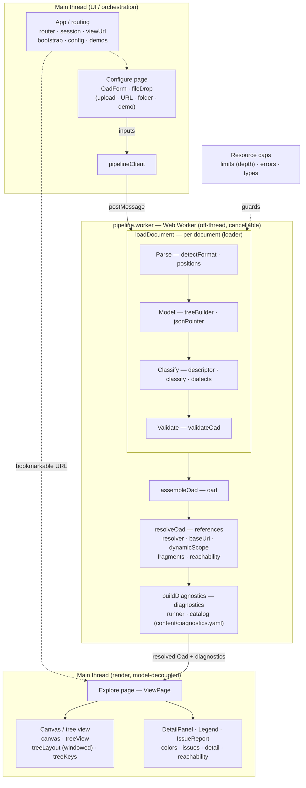

# Contributing

This guide covers the project's **architecture**, how its **tests, linting, and formatting** are
organized, and how to **prepare a release**.

## Tests

```bash
npm test         # run the suite once (Vitest)
npm run test:watch
npm run coverage # run with v8 coverage; writes coverage/ (HTML + lcov) and fails below threshold
npm run bench    # render + pipeline benchmarks over large synthetic docs; a normal `npm test` collects them but skips them
```

Specs live in [`test/`](test) mirroring `src/`, built on a `test/helpers.ts` that runs the
real pipeline (`loadDocument → assembleOad → resolveOad`). Vitest runs two projects: a
**node** project for the core logic — the reference resolver (including the `$dynamicRef`
dynamic-scope analysis), OAS classifier + 3.1/3.2 descriptor, model, parser, loader,
assembler — and a **browser** project (`vitest-browser-svelte`) for the Svelte components
(the input form, detail panel, and other islands). The d3/SVG canvas and tree view are
excluded from the coverage denominator (they need real browser layout), but the browser
project still drives the canvas directly to assert its **scalability invariant** — that a
large tree mounts only a bounded number of rows — alongside the browser/preview workflow and
the Playwright end-to-end suite (`npm run e2e`, which also runs axe accessibility checks). Two
`bench` harnesses are gated behind `VITE_BENCH` so they stay out of the gating run, both reporting
wall-clock timings that are machine-dependent and informational: a **render** bench
(`test/browser/treeCanvas.bench.svelte.test.ts`, render/expand timings) and a **pipeline** bench
(`test/pipeline.bench.test.ts`, the worker-side source-position and diagnostics stages versus the raw
parse and the full single-document finalize). Coverage is gated by thresholds in `vitest.config.ts`.

## Linting and formatting

```bash
npm run lint          # ESLint (flat config in eslint.config.js)
npm run format:check  # Prettier — verify formatting without writing (config in .prettierrc.json)
npm run format        # Prettier — reformat in place
```

Both `npm run lint` and `npm run format:check` are **CI gates** — a dedicated `lint` job in
`.github/workflows/ci.yml` — so run them locally before pushing. Prettier owns formatting and
ESLint is configured with `eslint-config-prettier`, so the two never fight over style.

## Architecture

A clean **model layer** (plain TypeScript) decoupled from rendering. The UI is **Svelte 5**,
with **History-API routing** splitting a Configure page from an Explore page; the d3/SVG
canvas is an imperative island wrapped by a Svelte component.

Inputs are collected on the Configure page, the whole load pipeline runs off-thread in a Web
Worker, and the resolved model drives the render layer (GitHub renders this Mermaid diagram):



| Layer | Files |
| --- | --- |
| Types | `src/types.ts`, `src/errors.ts`, `src/limits.ts` (resource caps) |
| Parse | `src/parse/detectFormat.ts`, `src/parse/positions.ts` (JSON Pointer → source line/column range) |
| Model | `src/model/jsonPointer.ts`, `src/model/treeBuilder.ts` |
| OAS classification | `src/oas/descriptor.ts` (declarative 3.1/3.2 grammar), `src/oas/classify.ts`, `src/oas/dialects.ts` (JSON Schema dialect selection) |
| Load / assemble | `src/loader.ts` (per document), `src/oad.ts` (whole OAD) |
| Validation | `src/validation/validateOad.ts` (OAS schema + per-dialect JSON Schema validation) |
| References | `src/refs/baseUri.ts`, `src/refs/resolver.ts`, `src/refs/types.ts`, `src/refs/diagnostics.ts` (per-edge advisories), `src/refs/dynamicScope.ts`, `src/refs/fragments.ts`, `src/refs/reachability.ts` |
| Diagnostics | `src/diagnostics/types.ts` (the unified `Diagnostic` model), `src/diagnostics/catalog.ts` (loads the severity policy + copy), `src/diagnostics/runner.ts` (collects every non-blocking finding) |
| Render | `src/render/canvas.ts`, `src/render/treeView.ts`, `src/render/treeLayout.ts` (windowing + label widths), `src/render/treeKeys.ts` (keyboard model), `src/render/colors.ts`, `src/render/issues.ts`, `src/render/reachability.ts`, `src/render/detail.ts`; Svelte islands `TreeCanvas.svelte`, `DetailPanel.svelte`, `Legend.svelte`, `IssueReport.svelte` |
| Worker pipeline | `src/app/pipelineClient.ts` (main-thread client), `src/app/pipeline.worker.ts` (off-thread load) |
| App / routing | `src/app/router.svelte.ts`, `src/app/session.svelte.ts`, `src/app/viewUrl.ts`, `src/app/config.ts`, `src/app/demos.ts`, `src/app/bootstrap.ts` |
| UI / shell | `src/main.ts`, `src/App.svelte`, `src/pages/ConfigurePage.svelte`, `src/pages/ViewPage.svelte`, `src/ui/OadForm.svelte`, `src/ui/ThemeToggle.svelte`, `src/ui/oadForm.ts`, `src/ui/fileDrop.ts`, `src/ui/theme.ts` |
| Styles / pages | `src/styles.css`, `src/theme.css`, `src/docs.css`, `vite/doc-pages.ts` (renders `CHANGELOG.md` to a themed page) |
| Content (editable, no code) | `content/demos.yaml` (demo labels + descriptions), `content/diagnostics.yaml` (diagnostic severity policy + titles/descriptions) — imported as data and merged in by id/code |

Each node keeps a stable **JSON Pointer** id and an `expectedType` (its grammar slot type),
and each document keeps its **base URI** (`$self` / retrieval URI) — the foundation the
resolver uses. Documents and `$id` schemas are indexed together as URI-identified
**resources**, so a reference resolves its target resource once and then locates the node.

The whole load pipeline (parse → classify → validate → resolve → diagnose) runs in a **Web
Worker** (`pipelineClient` on the main thread driving `pipeline.worker`), so a large or slow
document never freezes the UI and a load can be cancelled. The tree renderer is **windowed**: it
mounts only the rows near the viewport and tracks the rest analytically (`treeLayout.ts`), so
render and interaction stay bounded as a document grows.

**Diagnostics are unified.** Every *non-blocking* finding — an unresolved or mis-typed reference,
a reference advisory, a node-level resolution caveat, an unreachable document, an unvalidated
Schema Object — is collected by `buildDiagnostics` (in the worker, after resolution) into one flat
`Diagnostic[]`, each located by **JSON Pointer** and stamped with the severity its code carries in
`content/diagnostics.yaml`. The issue report, the canvas warning/advisory glyphs, and the detail
panel all read that one model, so they cannot drift, and only plain, cloneable data crosses back
from the worker. *Blocking* errors that refuse a document stay separate — thrown exceptions in
`errors.ts`. The model is shaped so an external linter could later be adapted into the same
`Diagnostic[]` (a `source` discriminator, pointer-keyed locations), but none is integrated.

**Line numbers** come from a separate, position-aware pass (`parse/positions.ts`) that re-reads each
document's text with the `yaml` CST and maps every JSON Pointer to its source range, keyed by the same
pointers as the tree. The detail panel and the issue report show a node's / a diagnostic's line beside
its pointer, and a located issue jumps to its node. It is best-effort (a pointer the pass can't locate
just shows no line) and runs in the worker after the size guards, so it never blocks the UI.

## Preparing a release

Releases are cut from `main` after the change has been merged, and **pushing the version tag deploys the
live site** (step 7). The running app bakes in its `package.json` version, and the deploy builds from the
lockfile, so both the **git tag** and a **correct `package-lock.json`** matter.

Prerequisites: **Node.js 24** and npm (the versions CI uses).

### 1. Start from a clean, up-to-date `main`

```bash
git checkout main
git pull
git status            # must report a clean working tree
```

### 2. Update the changelog and README

Add a section to [`CHANGELOG.md`](CHANGELOG.md) for the new version. Both parts matter — the second
is easy to forget:

- Heading: `## [X.Y.Z] — YYYY-MM-DD`, with the changes grouped (Added / Changed / Fixed / …).
- Compare link at the **bottom** of the file:
  `[X.Y.Z]: https://github.com/handrews/oas-tree-viewer/compare/v<previous>...vX.Y.Z`

If the release changes user-facing behavior, update [`README.md`](README.md) to match.

Leave these edits **uncommitted** — they go into the single release commit in step 5.

### 3. Install from the lockfile and confirm it is in sync

```bash
npm ci
```

`npm ci` installs strictly from `package-lock.json` and **fails if it is out of sync with
`package.json`**. Run it here so the lockfile problem below is caught locally instead of on CI.

> **Lockfile caution:** Running `npm install` to add a dependency can
> silently drop cross-platform **optional** packages from `package-lock.json` — e.g. the `@emnapi/*`
> wasm-fallback entries under `@napi-rs/wasm-runtime`. A lockfile that resolves on macOS then fails
> `npm ci` on the Linux CI runner with *"… can only install … in sync … Missing: @emnapi/core …"*.
> If you add or change a dependency: add its entry **on top of the existing lockfile** (or regenerate
> the lockfile on Linux) rather than committing a wholesale local regeneration, and confirm every
> `@emnapi/*` entry is still present. Note that `npm version` does **not** touch the dependency tree,
> so it neither causes nor fixes this, and `npm ci` only *detects* it — the fix is a correct lockfile.

### 4. Verify the build is green

All of these must pass before tagging (they mirror the CI jobs in `.github/workflows/ci.yml`):

```bash
npm run lint         # ESLint
npm run format:check # Prettier formatting check
npm run typecheck
npm run coverage     # runs the tests and enforces the coverage thresholds
npm run e2e          # Playwright + axe (starts its own dev server)
npm run build
```

### 5. Bump the version, then commit and tag as one release

Bump `package.json` **and** `package-lock.json` without letting npm commit or tag, so the changelog,
README, and version bump all land in a single `Release vX.Y.Z` commit:

```bash
npm version X.Y.Z --no-git-tag-version   # bumps package.json + package-lock.json only
git add -A
git commit -m "Release vX.Y.Z"           # changelog + README + version bump together
git tag -a vX.Y.Z -m vX.Y.Z              # ANNOTATED — required by --follow-tags in step 6
```

`--no-git-tag-version` keeps `npm version`'s lockfile-safe bump (it doesn't touch the dependency
tree — see the caution above) while letting us make one clean release commit instead of a separate
bare bump commit. The tag must be **annotated** (`-a`): `git push --follow-tags` only pushes
annotated tags, and every release tag to date is annotated — keep it that way.

### 6. Push `main` with the tag

```bash
git push origin main --follow-tags
```

`--follow-tags` pushes the annotated tag alongside `main`. Pushing the tag is what **triggers the
production deploy** (step 7), so the tag has to reach GitHub for the site to update.

### 7. The deploy (automatic, on the tag)

Pushing the `vX.Y.Z` tag triggers [`.github/workflows/deploy.yml`](.github/workflows/deploy.yml), which
runs `npm ci` → `npm run build` → `wrangler deploy` to publish the **`oas-tree-viewer`** Cloudflare
Worker, live at **<https://henryandrews.net/projects/oas>**. Nothing is vendored or copied by hand.

Confirm it: watch the **Deploy** run under the repo's Actions tab, then load
`https://henryandrews.net/projects/oas/` — and `https://henryandrews.net/projects/oas` (no trailing
slash), which should 307-redirect to the slashed form. To re-run a deploy **without** cutting a new
version (e.g. to retry a failed run), use **Actions → Deploy → Run workflow** — a `workflow_dispatch`
that deploys the current `main`.

**Required repo secrets** (Settings → Secrets and variables → Actions), for the Cloudflare account that
owns the Worker and the `henryandrews.net` zone:

- `CLOUDFLARE_API_TOKEN` — scopes **Workers Scripts: Edit** (account) + **Workers Routes: Edit** (zone).
- `CLOUDFLARE_ACCOUNT_ID`.

Deploy config lives in [`wrangler.jsonc`](wrangler.jsonc) + [`worker/index.js`](worker/index.js). Gotchas:

- **Wrangler 4 is required.** `cloudflare/wrangler-action@v3` installs a 3.x Wrangler by default, which
  predates Worker-with-assets-binding support and fails with _"Missing entry-point"_; `deploy.yml` pins
  `wranglerVersion: "4"`.
- **The app is served from a sub-path** (`/projects/oas/`), not a domain root — so `vite.config.ts` sets
  `base: "/projects/oas/"` and nests the build under `dist/projects/oas/`, and any same-origin URL the
  app builds (e.g. demo fixtures in `demos.ts`) must be prefixed with `import.meta.env.BASE_URL`. A bare
  `/fixtures/…` escapes the sub-path, 404s, and falls through to the SPA shell.
- **Two routes** are configured: `henryandrews.net/projects/oas/*` (the app + assets) and the exact
  `henryandrews.net/projects/oas` (the bare path, which `/*` does not match — Cloudflare's asset layer
  307-redirects it to the slashed form). Both must out-specify the main `henryandrews.net` Worker's catch-all
  (`henryandrews.net/*`); the more specific route wins.
- **Deep links** (`/projects/oas/view?…`) are served by `worker/index.js`, which returns the app shell
  for any path with no matching asset, so reloading a History-API route works.

