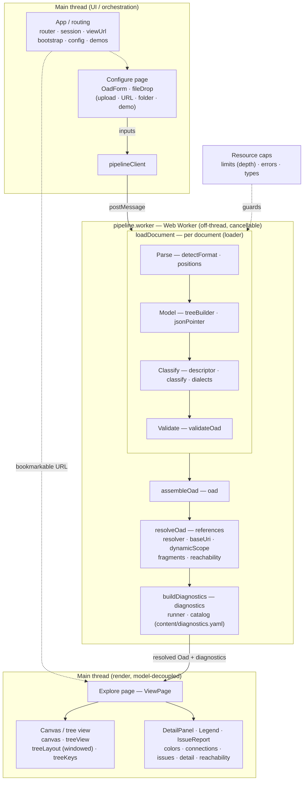

# Architecture

This document describes how the **OpenAPI Description Structure Viewer** is built. For what the
tool does and how to use it, see the [README](../README.md); for the test, linting, and release
mechanics, see [CONTRIBUTING](../CONTRIBUTING.md).

A clean **model layer** (plain TypeScript) is decoupled from rendering. The UI is **Svelte 5**,
with **History-API routing** splitting a Configure page from an Explore page; the d3/SVG
canvas is an imperative island wrapped by a Svelte component.

Inputs are collected on the Configure page, the whole load pipeline runs off-thread in a Web
Worker, and the resolved model drives the render layer (GitHub renders this Mermaid diagram):

## Layers

| Layer | Files |
| --- | --- |
| Types | `src/types.ts`, `src/errors.ts`, `src/limits.ts` (resource caps) |
| Parse | `src/parse/detectFormat.ts`, `src/parse/positions.ts` (JSON Pointer → source line/column range) |
| Model | `src/model/jsonPointer.ts`, `src/model/treeBuilder.ts` |
| OAS classification | `src/oas/descriptor.ts` (declarative 3.1/3.2 grammar), `src/oas/classify.ts`, `src/oas/dialects.ts` (JSON Schema dialect selection) |
| Load / assemble | `src/loader.ts` (per document), `src/oad.ts` (whole OAD) |
| Validation | `src/validation/validateOad.ts` (OAS schema + per-dialect JSON Schema validation) |
| References | `src/refs/baseUri.ts`, `src/refs/resolver.ts`, `src/refs/types.ts`, `src/refs/diagnostics.ts` (per-edge advisories), `src/refs/dynamicScope.ts`, `src/refs/fragments.ts`, `src/refs/reachability.ts` |
| Diagnostics | `src/diagnostics/types.ts` (the unified `Diagnostic` model), `src/diagnostics/catalog.ts` (loads the severity policy + copy), `src/diagnostics/runner.ts` (collects every non-blocking finding) |
| Connections | `src/connections/types.ts` (the style vocabulary + `family` axis), `src/connections/catalog.ts` (loads `content/connections.yaml`), `src/connections/style.ts` (per-connection class/marker/arrowhead selection) |
| Render | `src/render/canvas.ts`, `src/render/treeView.ts`, `src/render/treeLayout.ts` (windowing, label-width estimate + right-gutter glyph packing), `src/render/treeKeys.ts` (keyboard model), `src/render/colors.ts`, `src/render/issues.ts`, `src/render/reachability.ts`, `src/render/detail.ts`; Svelte islands `TreeCanvas.svelte`, `DetailPanel.svelte`, `Legend.svelte`, `IssueReport.svelte` |
| Worker pipeline | `src/app/pipelineClient.ts` (main-thread client), `src/app/pipeline.worker.ts` (off-thread load) |
| App / routing | `src/app/router.svelte.ts`, `src/app/session.svelte.ts`, `src/app/viewUrl.ts`, `src/app/config.ts`, `src/app/demos.ts`, `src/app/bootstrap.ts` |
| UI / shell | `src/main.ts`, `src/App.svelte`, `src/pages/ConfigurePage.svelte`, `src/pages/ViewPage.svelte`, `src/ui/OadForm.svelte`, `src/ui/ThemeToggle.svelte`, `src/ui/oadForm.ts`, `src/ui/fileDrop.ts`, `src/ui/theme.ts` |
| Styles / pages | `src/styles.css`, `src/theme.css`, `src/docs.css`, `vite/doc-pages.ts` (renders `CHANGELOG.md` to a themed page) |
| Content (editable, no code) | `content/demos.yaml` (demo labels + descriptions), `content/diagnostics.yaml` (diagnostic severity policy + titles/descriptions), `content/connections.yaml` (per-connection reference arrow/marker styles) — imported as data and keyed by id/code/kind |

## Off-thread load pipeline

The whole load pipeline (parse → classify → validate → resolve → diagnose) runs in a **Web
Worker** (`pipelineClient` on the main thread driving `pipeline.worker`), so a large or slow
document never freezes the UI and a load can be cancelled mid-flight. Only plain, cloneable
data crosses back from the worker.

Validation runs **offline**: the official OAS 3.0/3.1/3.2 JSON Schemas (and the JSON Schema
dialect schemas) are bundled rather than fetched at runtime, and checked with
`@hyperjump/json-schema`. In 3.1/3.2 a Schema Object *is* JSON Schema, so each is additionally
validated against the dialect it declares in `$schema` (the OAS dialect, JSON Schema 2020-12
and 2019-09, and draft-07/06/04); a Schema Object on an older or unknown dialect still renders,
flagged as unvalidated. In **3.0** a Schema Object is *not* JSON Schema, so there are no
dialects — the single 3.0 schema validates the whole document.

## OpenAPI version handling

Behavior is keyed by OAS **minor-release family** — `3.0`, `3.1`, or `3.2`. Patch releases carry no
schema-impacting changes within a minor line, so a patch number is accepted but never used for schema
selection or feature gating; the family threads through classification, validation, and reference
resolution as a single `VersionFamily` value.

The pivotal split is the Schema Object: in **3.0** it is an OAS-specific dialect (no
`$id`/`$anchor`/dynamic keywords, and a Schema `$ref` is a plain Reference Object), whereas in
**3.1/3.2** it *is* JSON Schema and may switch dialect mid-document via `$schema`. That difference is
what makes the dialect-aware indexing and the `$dynamicRef`/`$recursiveRef` analysis below necessary.

## Resources and reference resolution

Each node keeps a stable **JSON Pointer** id and an `expectedType` (its grammar slot type),
and each document keeps its **base URI** (`$self` / retrieval URI) — the foundation the
resolver uses. Documents and `$id` schemas are indexed together as URI-identified
**resources**, so a reference resolves its target resource once and then locates the node by
JSON Pointer **or** `$anchor`/plain-name fragment. Base-URI handling is JSON-Schema-correct: a
nested `$id` re-scopes the base, and a target can be same-document or across the loaded
documents (matched by `$self` / retrieval URI).

The resolver covers every kind of connection an OAS 3.1/3.2 description can express:

- **`$ref`** (in Reference, Path Item, and Schema objects) and **`operationRef`** (in Link
  objects) — URI-references, drawn as solid arcs.
- **Component-name references** — Discriminator `mapping` values and Security Requirement
  keys, each resolved as a component name or a URI-reference (per OAS version and the
  resolution options) and drawn as a distinct **implicit connection**.
- **Link `operationId`** — resolved to its Operation, as an implicit connection.
- **`$dynamicRef` / `$dynamicAnchor`** (2020-12) — a dynamic `$dynamicRef` is drawn as
  **tentative, dotted** arcs to its *strict winners*: the `$dynamicAnchor`s that could actually
  be its runtime resolution (the outermost same-named anchor on an evaluation path, rooted in
  the entry document, that reaches the reference). The JSON Schema "bookending" cases (a local
  `$anchor`, or a `$ref` landing on a `$dynamicAnchor`) resolve statically, like `$ref`.
- **`$recursiveRef` / `$recursiveAnchor`** (2019-09) — the anonymous predecessor of
  `$dynamicRef`, resolved with the same tentative-dotted strict-winner analysis; a
  `$recursiveRef` with no `$recursiveAnchor` in scope is a plain static reference.
- **Older-dialect identification** — Schema Objects declaring **draft-07/06/04** use identifier
  (`$id`, or `id` in draft-04) fragments for anchors and ignore keywords next to `$ref`; the
  viewer resolves them by those rules and flags the ignored-`$ref`-sibling and
  bad-identifier-fragment cases. A dialect older than draft-04 (or unknown) is drawn with
  2020-12 rules.
- **Operation-reference advisories** — an `operationRef`/`operationId` that resolves but points
  somewhere not unambiguously callable (e.g. a webhook or callback Operation) is flagged with
  an advisory rather than treated as broken.

A reference must land on a slot of the matching **expected type** (a Reference Object inherits
the type of the slot it occupies; an operation reference must hit an Operation). The outcomes —
**resolved**, **type-mismatch**, **broken** (fragment not found), and **external** (target
document not loaded) — feed both the drawn arcs and the diagnostics below.

### Document-type inference for fragments

With **document fragments** enabled, a document that is neither an OpenAPI Object nor a
recognized JSON Schema (e.g. a bare Path Item Object or a shared schema library) is loaded
anyway, and its type is **inferred from the references that point at it**. *Referenced by the
root* types a fragment only when a reference targets its root; *Any fragment* additionally
types from references to interior nodes, where only the referenced node and its descendants
take a type. References that **over-determine** a node — two that disagree, or one that
disagrees with an enclosing referenced ancestor — make just that subtree generic and any
reference into it a type error; a conflict at the root makes the whole fragment generic. A
fragment is never an entry document unless something cleanly types its root.

## Windowed rendering

The tree renderer is **windowed**: it mounts only the rows near the viewport and tracks the
rest analytically (`treeLayout.ts`), so render and interaction stay bounded as a document
grows. Documents are laid out side by side on one shared zoom/pan canvas, and the trees are a
keyboard-navigable, screen-reader-accessible WAI-ARIA tree.

Because loading is off-thread and rendering is windowed, document **size and node count are not
capped** — large single-file descriptions (GitHub-/Stripe-scale) load directly. The only
default resource guard is a **depth limit** (`limits.ts`, `MAX_TREE_DEPTH = 128`), which
refuses pathological nesting up front rather than risking a stack-overflow downstream, with a
**Load anyway** override that retries with the limit lifted.

## Unified diagnostics

Every *non-blocking* finding — an unresolved or mis-typed reference, a reference advisory, a
node-level resolution caveat, an unreachable document, an unvalidated Schema Object — is
collected by `buildDiagnostics` (in the worker, after resolution) into one flat `Diagnostic[]`,
each located by **JSON Pointer** and stamped with the severity its code carries in
`content/diagnostics.yaml`. The issue report, the canvas warning/advisory glyphs, and the
detail panel all read that one model, so they cannot drift, and only plain, cloneable data
crosses back from the worker. *Blocking* errors that refuse a document stay separate — thrown
exceptions in `errors.ts`. The model is shaped so an external linter could later be adapted
into the same `Diagnostic[]` (a `source` discriminator, pointer-keyed locations), but none is
integrated.

## Connection styles are data

Every drawn connection (today, references; the `family` axis leaves room for non-reference
*structural relationships* a parser must reconcile — drawn, never performed) takes its base
look from a catalog, `content/connections.yaml`, keyed by connection kind: line
(single/double), dash (solid/dashed/dotted), arrowhead, and marker, each from a bounded
vocabulary that maps to fixed CSS classes. One pure helper (`src/connections/style.ts`) turns a
kind plus its render state (resolve status, advisory severity, collapsed, focused) into the
arc's classes, and the tree marker, the arc, and the legend all read that one catalog — so
restyling a category is a YAML edit, not a CSS change, and they cannot drift.

## Line numbers

Line numbers come from a separate, position-aware pass (`parse/positions.ts`) that re-reads
each document's text with the `yaml` CST and maps every JSON Pointer to its source range, keyed
by the same pointers as the tree. The detail panel and the issue report show a node's / a
diagnostic's line beside its pointer, and a located issue jumps to its node. It is best-effort
(a pointer the pass can't locate just shows no line) and runs in the worker after the size
guards, so it never blocks the UI.
